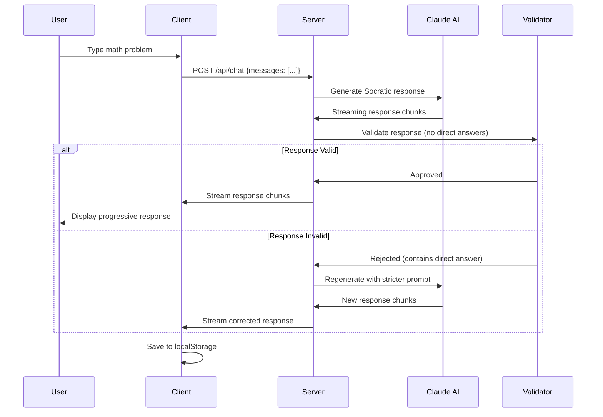
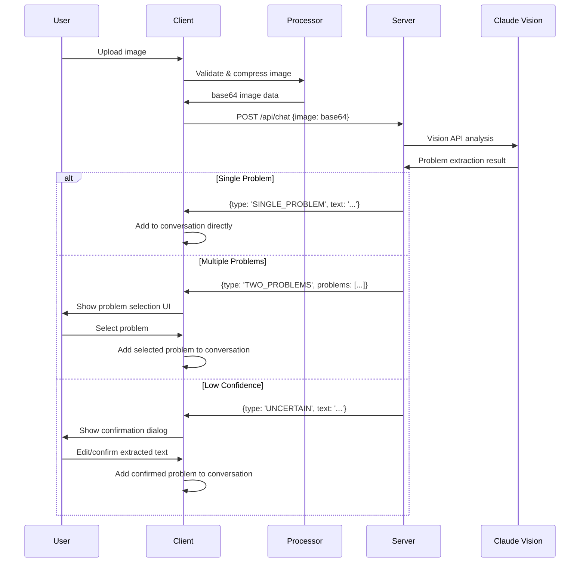
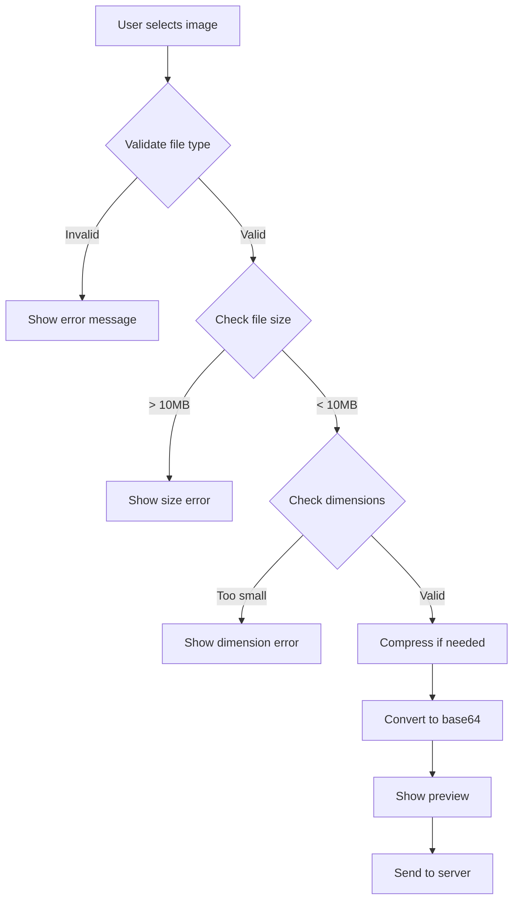
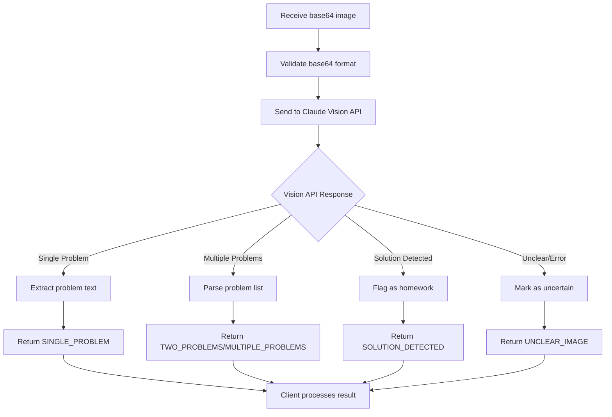
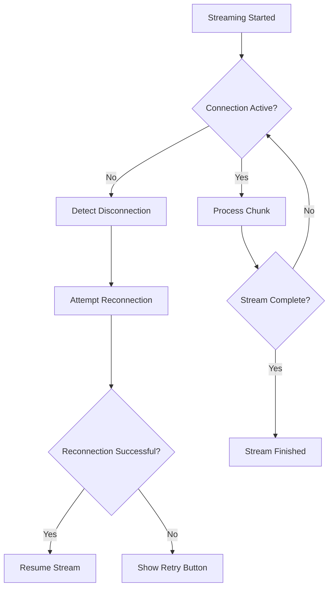
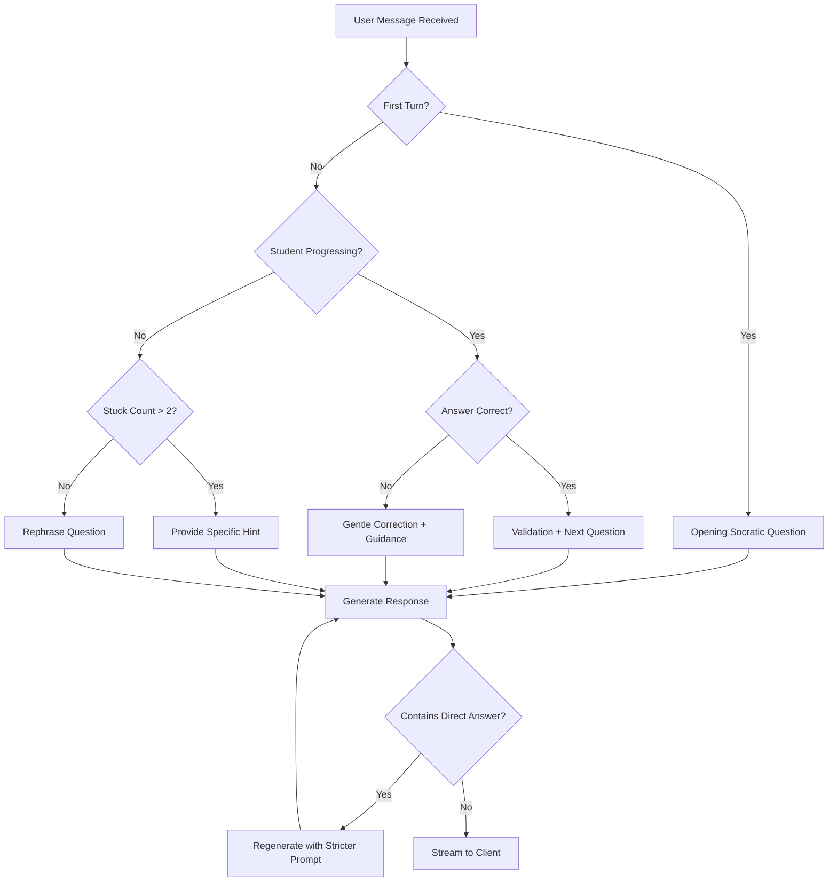
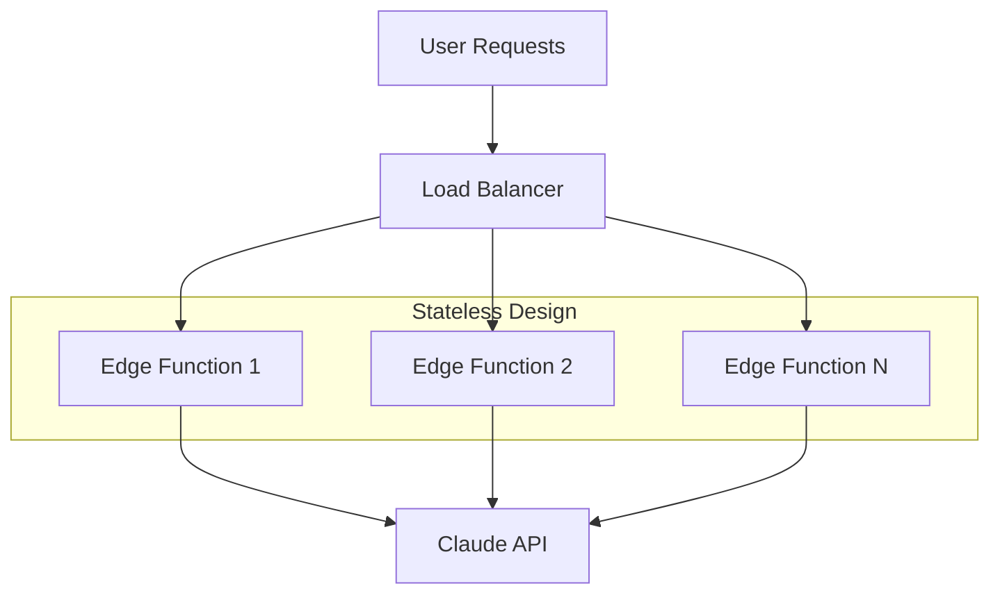
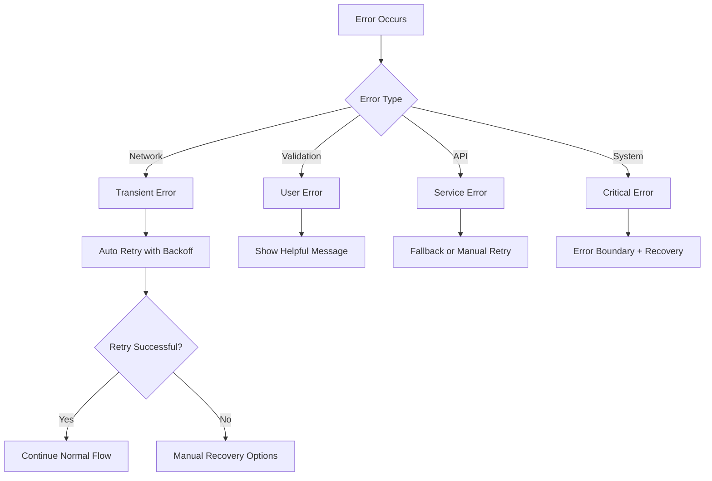

# AI Math Tutor - System Architecture
## Client-Server Interactions & AI Integration Points

**Version:** 1.0  
**Date:** November 3, 2025  
**Scope:** System design, data flows, AI integration architecture  
**Companion Docs:** cursor-prd-comprehensive.md, AI_Math_Tutor_Implementation_Tasks.md

---

## Table of Contents
1. [High-Level Architecture](#high-level-architecture)
2. [AI Integration Points](#ai-integration-points)
3. [Data Flow Patterns](#data-flow-patterns)
4. [Client-Server Communication](#client-server-communication)
5. [Image Processing Pipeline](#image-processing-pipeline)
6. [State Management Architecture](#state-management-architecture)
7. [Streaming Response Architecture](#streaming-response-architecture)
8. [AI Decision Logic](#ai-decision-logic)
9. [Security Architecture](#security-architecture)
10. [Performance & Scaling Considerations](#performance--scaling-considerations)
11. [Error Propagation & Recovery](#error-propagation--recovery)

---

## High-Level Architecture

### **System Overview**

```mermaid
graph TB
    User[👤 Student User]
    Browser[🌐 Browser Client]
    CDN[🚀 Vercel Edge Network]
    Server[⚡ Next.js Server]
    Claude[🧠 Claude AI API]
    Storage[💾 Browser Storage]
    
    User --> Browser
    Browser --> CDN
    CDN --> Server
    Server <--> Claude
    Browser <--> Storage
    
    subgraph "Client Side"
        Browser
        Storage
    end
    
    subgraph "Server Side"
        Server
    end
    
    subgraph "AI Services"
        Claude
    end
```


### **Architecture Principles**

| Principle | Implementation | Rationale |
|-----------|----------------|-----------|
| **AI-First Design** | Claude AI at the core of all interactions | Socratic tutoring requires intelligent dialogue |
| **Edge-Optimized** | Vercel Edge functions for low latency | Fast response times critical for learning flow |
| **Stateless Server** | No server-side session storage | Simplifies deployment, scales horizontally |
| **Client-Side State** | React + localStorage for persistence | Reduces server complexity, works offline |
| **Streaming-Native** | Real-time AI response streaming | Natural conversation feel, reduces perceived latency |
| **Fail-Safe Design** | Multiple fallback layers | Graceful degradation for educational continuity |

---

## AI Integration Points

### **1. Primary AI Engine (Claude API)**
```
┌─────────────────────────────────────────────┐
│                Claude AI                    │
├─────────────────────────────────────────────┤
│ Model: claude-3-5-sonnet-20241022          │
│ Context Window: 200k tokens                │
│ Capabilities:                              │
│   • Socratic Dialogue Generation          │
│   • Vision API (Image → Text)             │
│   • Streaming Response                     │
│   • Mathematical Reasoning                 │
└─────────────────────────────────────────────┘
          ▲                    │
          │ Prompts            │ Responses
          │                    ▼
┌─────────────────────────────────────────────┐
│            AI Orchestration Layer          │
├─────────────────────────────────────────────┤
│ • System Prompt Management                 │
│ • Response Validation                      │
│ • Context Window Management                │
│ • Retry Logic                              │
│ • Cost Optimization                        │
└─────────────────────────────────────────────┘
```

### **2. AI Decision Points**

#### **Text Problem Processing**
```typescript
// AI Decision Flow
type AIDecisionPoint = {
  input: UserMessage;
  context: ConversationHistory;
  decision: 'socratic_response' | 'clarification_needed' | 'hint_required';
  confidence: number;
}

// Socratic Response Generation
if (studentStuck && turnCount > 2) {
  prompt = SOCRATIC_PROMPT + HINT_GUIDANCE;
} else if (studentProgressing) {
  prompt = SOCRATIC_PROMPT + ENCOURAGEMENT_FOCUS;
} else {
  prompt = SOCRATIC_PROMPT + STANDARD_GUIDANCE;
}
```

#### **Image Problem Extraction**
```typescript
// Vision API Decision Matrix
type ImageAnalysisResult = {
  problemCount: number;
  confidence: 'high' | 'medium' | 'low';
  content: 'problem' | 'solution' | 'unclear' | 'non_math';
  extraction: string[];
}

// Multi-step AI Processing
const visionResult = await claudeVision.analyze(image);
if (visionResult.confidence === 'low') {
  // Trigger user confirmation workflow
  return { type: 'UNCERTAIN', text: visionResult.extraction[0] };
} else if (visionResult.problemCount > 1) {
  // Trigger problem selection workflow  
  return { type: 'MULTIPLE_PROBLEMS', problems: visionResult.extraction };
}
```

### **3. AI Response Validation Pipeline**
```
User Input → Claude AI → Response Validation → Client
                ↓              ↓
        [Direct Answer     [Pass Through]
         Detection]             ↓
             ↓              Streaming to
        [Regenerate with     Client UI
         Stricter Prompt]
```

---

## Data Flow Patterns

### **1. Text Problem Solving Flow**



### **2. Image Problem Extraction Flow**



### **3. Real-Time Streaming Data Flow**

```
Client Request → Server → Claude AI
     ↑                        ↓
     └── Streaming ← Server ← Streaming Response
         Response              Chunks
         
Timeline:
T+0ms:    Request sent
T+200ms:  First token received  
T+300ms:  Token displayed to user
T+500ms:  Partial sentence visible
T+2000ms: Complete response displayed
```

---

## Client-Server Communication

### **API Contract Design**

#### **POST /api/chat**
```typescript
// Request Schema
interface ChatRequest {
  messages: Array<{
    role: 'user' | 'assistant';
    content: string;
    image?: string; // base64 encoded
    timestamp?: number;
  }>;
}

// Response Schema (Streaming)
interface ChatResponse {
  // Server-Sent Events stream
  data: string; // JSON chunks
  // Final format matches Vercel AI SDK
}

// Error Response Schema
interface ChatError {
  error: string;
  code: 'RATE_LIMIT' | 'INVALID_KEY' | 'NETWORK_ERROR' | 'VALIDATION_ERROR';
  retryAfter?: number; // seconds
  details?: string;
}
```

### **Communication Patterns**

#### **1. Standard Text Exchange**
```
Client                           Server
  │                               │
  ├─ POST /api/chat              ─┤
  │  {messages: [...]}            │
  │                               ├─ Validate request
  │                               ├─ Call Claude API  
  │                               ├─ Validate response
  ├─ SSE stream starts           ─┤
  ├─ data: {"chunk": "What"}     ─┤
  ├─ data: {"chunk": " do"}      ─┤
  ├─ data: {"chunk": " we know?"} ─┤ 
  ├─ data: {"done": true}        ─┤
  │                               │
```

#### **2. Image Processing Exchange**
```
Client                           Server
  │                               │
  ├─ POST /api/chat              ─┤
  │  {messages: [...], image: base64} │
  │                               ├─ Validate image
  │                               ├─ Process with Vision API
  │                               ├─ Parse extraction result
  ├─ JSON response               ─┤
  │  {type: "TWO_PROBLEMS",       │
  │   problems: [...]}            │
  │                               │
```

#### **3. Error Recovery Communication**
```
Client                           Server
  │                               │
  ├─ POST /api/chat              ─┤
  │                               ├─ Rate limit exceeded (429)
  ├─ HTTP 429 + retry info       ─┤
  │  {error: "...", retryAfter: 60}│
  │                               │
  ├─ Wait 60 seconds              │
  ├─ Retry POST /api/chat        ─┤
  │                               ├─ Success
  ├─ SSE stream starts           ─┤
```

---

## Image Processing Pipeline

### **Client-Side Processing**


### **Server-Side AI Processing**


### **Image Processing Data Transformations**

```typescript
// Client-side transformations
File → Validation → Compression → Base64 → Server

// Server-side transformations  
Base64 → Claude Vision → Problem Analysis → Classification → Response

// Data size optimization
Original Image (5MB) 
  → Compressed (800KB) 
  → Base64 (1.1MB) 
  → Vision API (processed)
  → Text Response (2KB)
```

---

## State Management Architecture

### **Client-Side State Layers**

```
┌─────────────────────────────────────┐
│           React Component State      │  ← UI state, form inputs
├─────────────────────────────────────┤
│           useChat Hook State        │  ← Messages, loading, errors  
├─────────────────────────────────────┤
│           Custom Hook State         │  ← Conversation state, image upload
├─────────────────────────────────────┤
│           localStorage              │  ← Persistence layer
└─────────────────────────────────────┘
```

### **State Flow Architecture**
```typescript
// State Management Pattern
interface AppState {
  // Managed by useChat (Vercel AI SDK)
  messages: Message[];
  isLoading: boolean;
  error: Error | null;
  
  // Custom application state
  conversationState: 'chatting' | 'selecting-problem' | 'confirming-extraction';
  pendingProblems: string[];
  currentImage?: string;
  
  // Persistence state
  hasUnsavedChanges: boolean;
  lastSaved: Date;
}

// State Transitions
const stateTransitions = {
  'chatting': ['selecting-problem', 'confirming-extraction'],
  'selecting-problem': ['chatting'],
  'confirming-extraction': ['chatting']
};
```

### **Data Persistence Strategy**

```mermaid
graph LR
    A[User Action] --> B[Update React State]
    B --> C{State Changed?}
    C -->|Yes| D[Update localStorage]
    C -->|No| E[No Action]
    D --> F[Handle Quota Exceeded]
    F --> G[Cleanup Old Data]
    
    subgraph "Persistence Layer"
        H[conversation: Message[]]
        I[conversationState: State]
        J[problemHistory: Problem[]]
    end
```

---

## Streaming Response Architecture

### **Real-Time Communication Stack**

```
┌─────────────────────────────────────┐
│        Browser (EventSource)        │  ← Client-side streaming
├─────────────────────────────────────┤  
│        Vercel Edge Runtime          │  ← Low-latency edge processing
├─────────────────────────────────────┤
│        Next.js Streaming API        │  ← Server-sent events
├─────────────────────────────────────┤
│        Vercel AI SDK               │  ← Stream management
├─────────────────────────────────────┤
│        Claude API (SSE)            │  ← AI response streaming
└─────────────────────────────────────┘
```

### **Streaming Performance Optimizations**

#### **Chunk Processing Strategy**
```typescript
// Optimized streaming processing
interface StreamChunk {
  text: string;
  timestamp: number;
  tokenCount: number;
}

// Client-side buffer management
class StreamBuffer {
  private buffer: string = '';
  private flushTimeout?: NodeJS.Timeout;
  
  append(chunk: string) {
    this.buffer += chunk;
    this.scheduleFlush();
  }
  
  private scheduleFlush() {
    // Debounce rapid chunks for smooth UI updates
    clearTimeout(this.flushTimeout);
    this.flushTimeout = setTimeout(() => {
      this.flush();
    }, 16); // 60fps update rate
  }
}
```

#### **Network Resilience**


---

## AI Decision Logic

### **Socratic Response Decision Tree**



### **AI Context Management**

```typescript
// Context Window Management
interface AIContext {
  problemText: string;
  conversationHistory: Message[];
  studentLevel: 'elementary' | 'middle' | 'high';
  stuckCount: number;
  lastHintGiven?: string;
  progressMarkers: string[];
}

// Context Optimization Strategy
class ContextManager {
  optimize(context: AIContext): OptimizedContext {
    // Keep only relevant conversation turns
    const relevantTurns = context.conversationHistory
      .slice(-10) // Last 10 messages
      .filter(msg => msg.role === 'user' || msg.content.includes('?'));
    
    return {
      ...context,
      conversationHistory: relevantTurns,
      tokenCount: this.estimateTokens(relevantTurns)
    };
  }
}
```

### **AI Response Quality Assurance**

```typescript
// Multi-layer validation pipeline
interface ResponseValidation {
  containsDirectAnswer: boolean;
  hasSocraticQuestions: boolean;
  usesEncouragingLanguage: boolean;
  isOnTopic: boolean;
  confidence: number;
}

const validateResponse = async (
  response: string, 
  context: AIContext
): Promise<ResponseValidation> => {
  return {
    containsDirectAnswer: DIRECT_ANSWER_PATTERNS.some(p => p.test(response)),
    hasSocraticQuestions: /\?/.test(response),
    usesEncouragingLanguage: ENCOURAGING_PATTERNS.some(p => p.test(response)),
    isOnTopic: calculateTopicRelevance(response, context.problemText),
    confidence: calculateOverallConfidence(response)
  };
};
```

---

## Security Architecture

### **API Security Layers**

```
┌─────────────────────────────────────┐
│           Rate Limiting             │  ← DOS protection
├─────────────────────────────────────┤
│           Input Validation          │  ← Injection prevention  
├─────────────────────────────────────┤
│           Authentication            │  ← API key validation
├─────────────────────────────────────┤
│           Data Sanitization         │  ← XSS prevention
├─────────────────────────────────────┤
│           Response Filtering        │  ← Content safety
└─────────────────────────────────────┘
```

### **Client-Side Security**

#### **Input Sanitization**
```typescript
// Image upload security
const validateImageSecurely = (file: File): SecurityCheck => {
  return {
    fileTypeValid: ALLOWED_MIME_TYPES.includes(file.type),
    fileSizeValid: file.size <= MAX_FILE_SIZE,
    fileNameSafe: !/[<>:"/\\|?*]/.test(file.name),
    noEmbeddedScripts: true // Browser handles this for images
  };
};

// Text input sanitization  
const sanitizeUserInput = (input: string): string => {
  return DOMPurify.sanitize(input, {
    ALLOWED_TAGS: [], // No HTML allowed
    ALLOWED_ATTR: []
  });
};
```

#### **Data Privacy**
```typescript
// Privacy-first data handling
interface PrivacyControls {
  // No server-side storage of conversations
  dataStorage: 'localStorage-only';
  
  // No user tracking
  analytics: 'none';
  
  // API key protection
  keyExposure: 'server-side-only';
  
  // Image handling
  imageRetention: 'processing-only'; // Not stored
}
```

### **Server-Side Security**

#### **API Route Protection**
```typescript
// Request validation middleware
const validateRequest = (req: Request): ValidationResult => {
  // Rate limiting
  if (exceedsRateLimit(req.ip)) {
    throw new RateLimitError('Too many requests');
  }
  
  // Input size limits
  if (req.body.length > MAX_REQUEST_SIZE) {
    throw new PayloadTooLargeError('Request too large');
  }
  
  // Content validation
  const { messages } = req.body;
  if (!Array.isArray(messages)) {
    throw new ValidationError('Invalid messages format');
  }
  
  return { valid: true };
};
```

---

## Performance & Scaling Considerations

### **Performance Optimization Stack**

```
┌─────────────────────────────────────┐
│           CDN Caching               │  ← Static asset caching
├─────────────────────────────────────┤
│           Edge Functions            │  ← Geographic distribution
├─────────────────────────────────────┤  
│           Response Streaming        │  ← Perceived performance
├─────────────────────────────────────┤
│           Bundle Optimization       │  ← Code splitting
├─────────────────────────────────────┤
│           Image Optimization        │  ← Compression & sizing
└─────────────────────────────────────┘
```

### **Scaling Architecture**

#### **Horizontal Scaling Model**


#### **Performance Metrics & Monitoring**

```typescript
// Performance tracking
interface PerformanceMetrics {
  // Client-side metrics
  timeToFirstByte: number;
  firstContentfulPaint: number;
  streamingStartTime: number;
  streamingEndTime: number;
  
  // Server-side metrics  
  apiResponseTime: number;
  claudeApiLatency: number;
  imageProcessingTime: number;
  
  // User experience metrics
  conversationTurns: number;
  problemSolveTime: number;
  errorRate: number;
}

// Performance optimization triggers
const optimizationTriggers = {
  // If response time > 3s, implement caching
  slowResponse: 3000,
  
  // If streaming delay > 500ms, optimize chunks  
  streamingDelay: 500,
  
  // If bundle size > 2MB, implement code splitting
  bundleSize: 2 * 1024 * 1024
};
```

### **Cost Optimization Architecture**

#### **AI API Cost Management**
```typescript
// Cost-aware request handling
interface CostControls {
  // Request optimization
  tokenLimits: {
    maxInputTokens: 4000;
    maxOutputTokens: 1000;
  };
  
  // Caching strategy  
  responseCache: {
    commonProblems: Map<string, CachedResponse>;
    cacheTTL: 3600; // 1 hour
  };
  
  // Usage monitoring
  dailyLimits: {
    textRequests: 1000;
    visionRequests: 200;
    estimatedCost: 50; // USD
  };
}
```

---

## Error Propagation & Recovery

### **Error Classification System**



### **Recovery Strategy Architecture**

#### **Graceful Degradation Layers**
```typescript
// Multi-tier fallback system
interface FallbackStrategy {
  // Tier 1: Full functionality
  primary: {
    textInput: true;
    imageUpload: true;
    streamingResponses: true;
    latexRendering: true;
  };
  
  // Tier 2: Core functionality  
  degraded: {
    textInput: true;
    imageUpload: false; // Fallback to manual entry
    streamingResponses: false; // Full response only
    latexRendering: true;
  };
  
  // Tier 3: Essential functionality
  minimal: {
    textInput: true;
    imageUpload: false;
    streamingResponses: false; 
    latexRendering: false; // Raw text only
  };
}
```

#### **Error Recovery Workflows**

```typescript
// Comprehensive error recovery
class ErrorRecoveryManager {
  async handleError(error: AppError, context: ErrorContext): Promise<RecoveryAction> {
    switch (error.category) {
      case 'RATE_LIMIT':
        return this.handleRateLimit(error);
        
      case 'IMAGE_PROCESSING':
        return this.handleImageError(error, context);
        
      case 'AI_RESPONSE':
        return this.handleAIError(error, context);
        
      case 'NETWORK':
        return this.handleNetworkError(error);
        
      default:
        return this.handleGenericError(error);
    }
  }
  
  private async handleRateLimit(error: RateLimitError): Promise<RecoveryAction> {
    return {
      type: 'RETRY_WITH_DELAY',
      delay: error.retryAfter * 1000,
      maxRetries: 3,
      userMessage: `I'm getting lots of questions right now. Retrying in ${error.retryAfter} seconds...`
    };
  }
}
```

---

## Conclusion

This architecture supports:

✅ **AI-Centric Design** - Claude AI as the intelligent core with validation layers  
✅ **Real-Time Interaction** - Streaming responses with network resilience  
✅ **Scalable Foundation** - Stateless, edge-optimized, horizontally scalable  
✅ **Robust Error Handling** - Multi-tier fallbacks and graceful degradation  
✅ **Security-First** - Input validation, rate limiting, privacy protection  
✅ **Performance Optimized** - Streaming, caching, and bundle optimization  

The architecture ensures that AI interactions feel natural and immediate while maintaining reliability, security, and cost efficiency at scale.

---

**Architecture complements:**
- **cursor-prd-comprehensive.md** - Technical implementation details
- **AI_Math_Tutor_Implementation_Tasks.md** - Development execution plan
