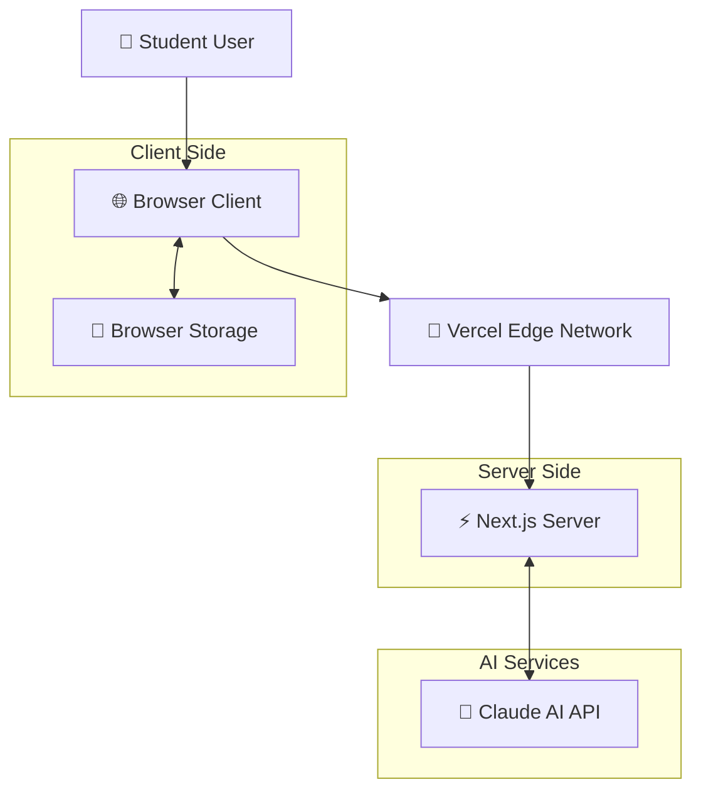
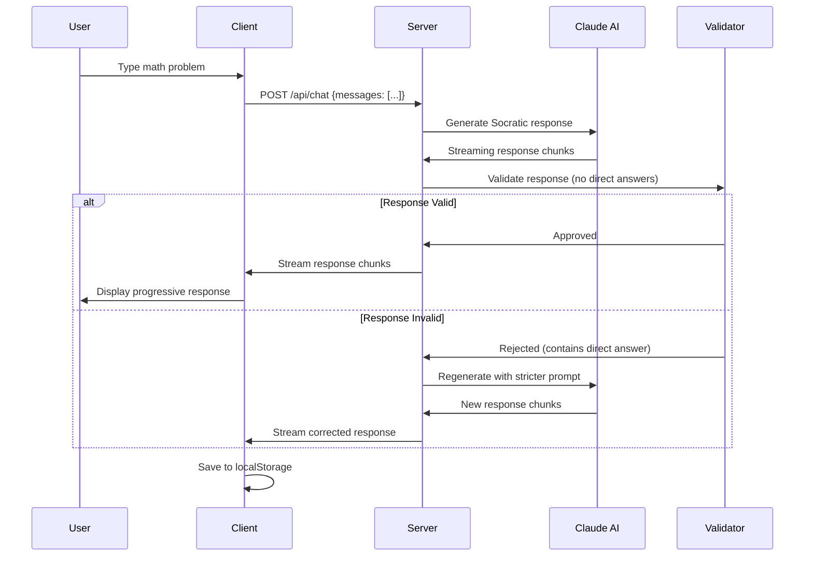
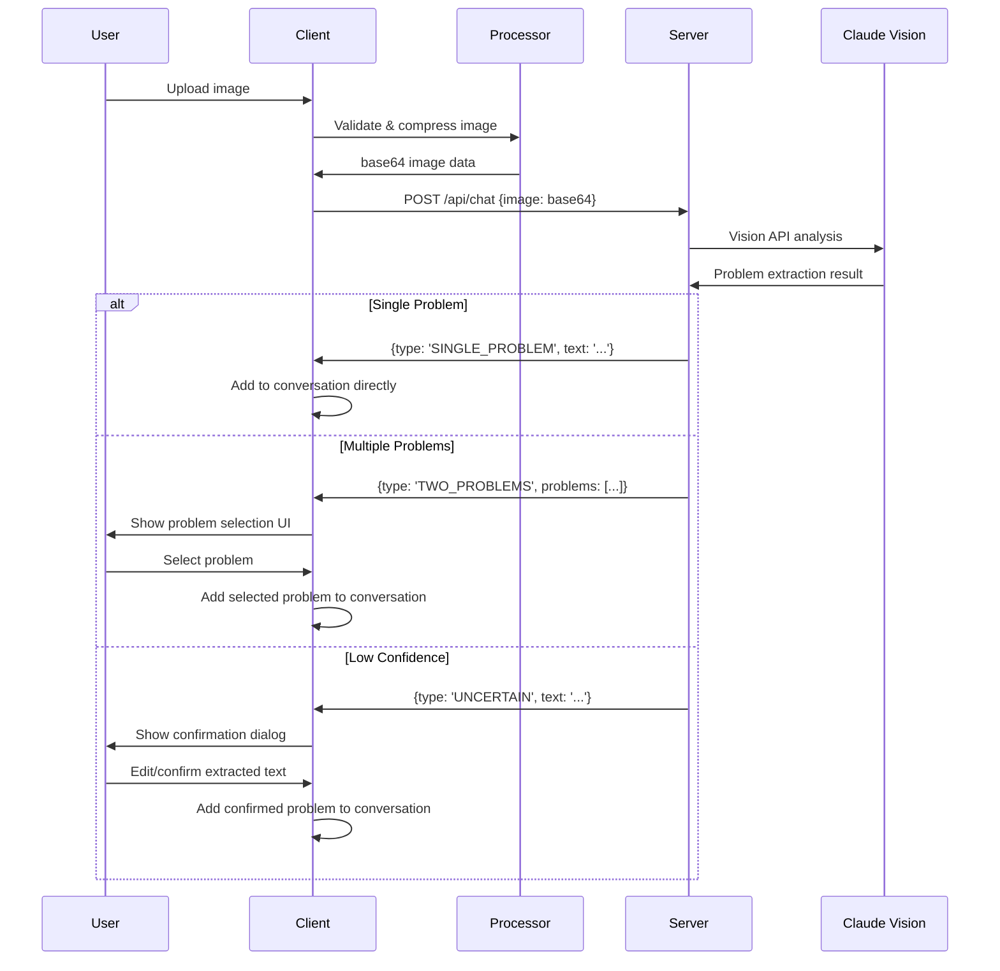
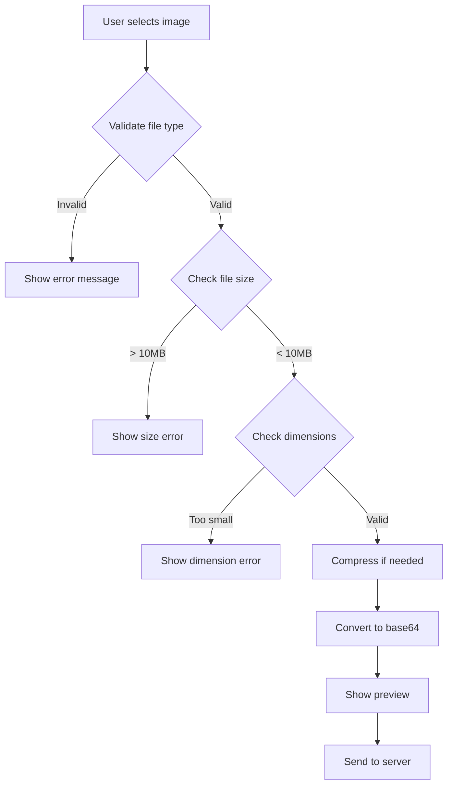
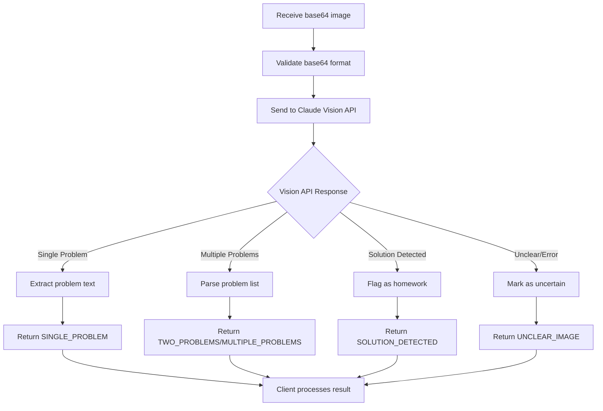
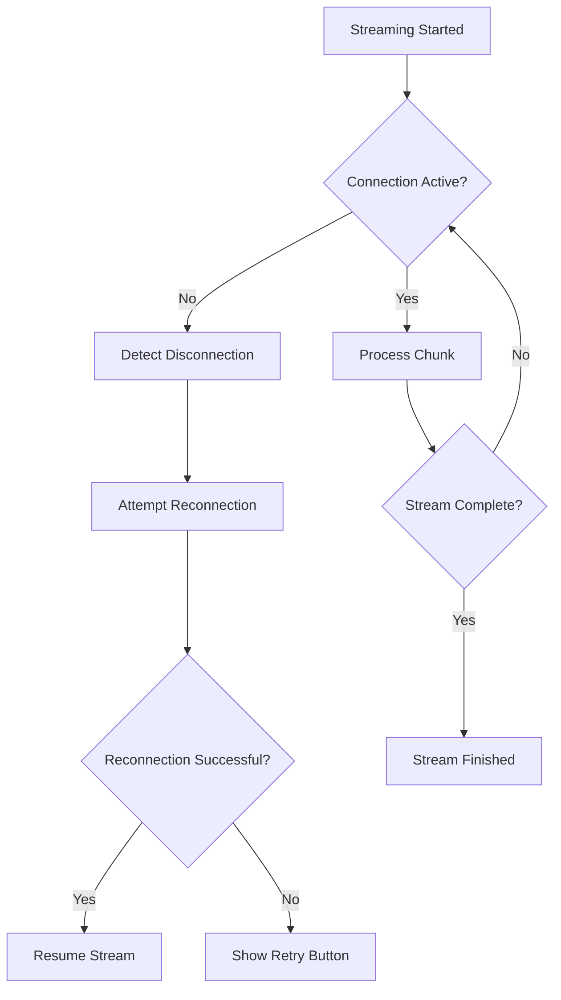
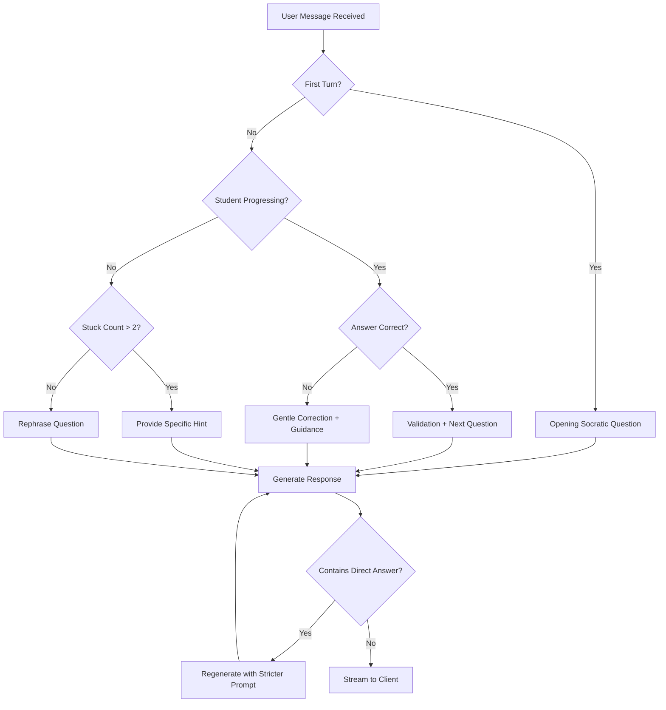
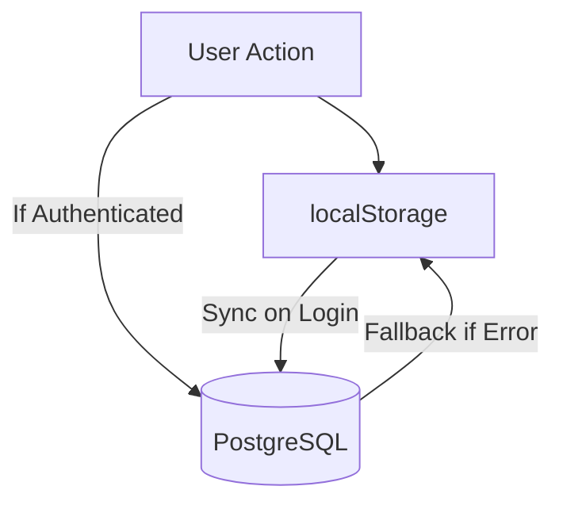
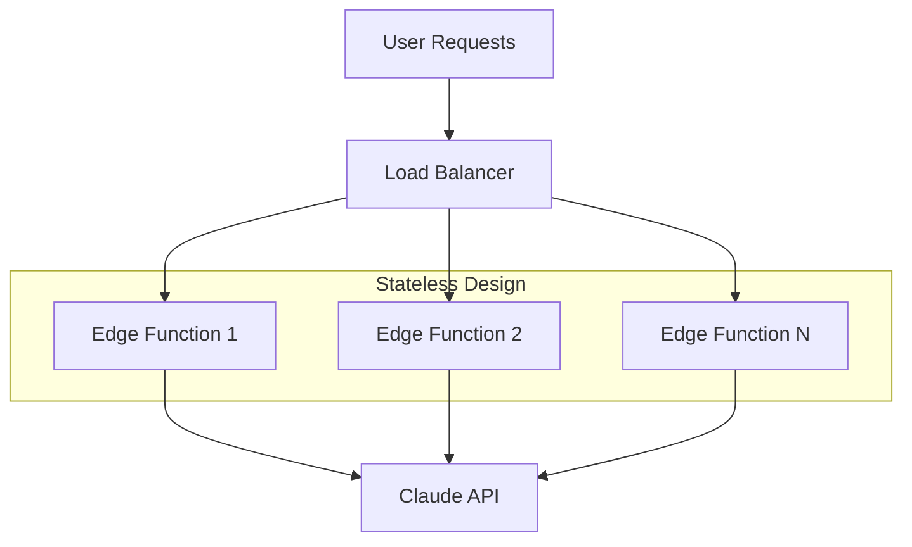
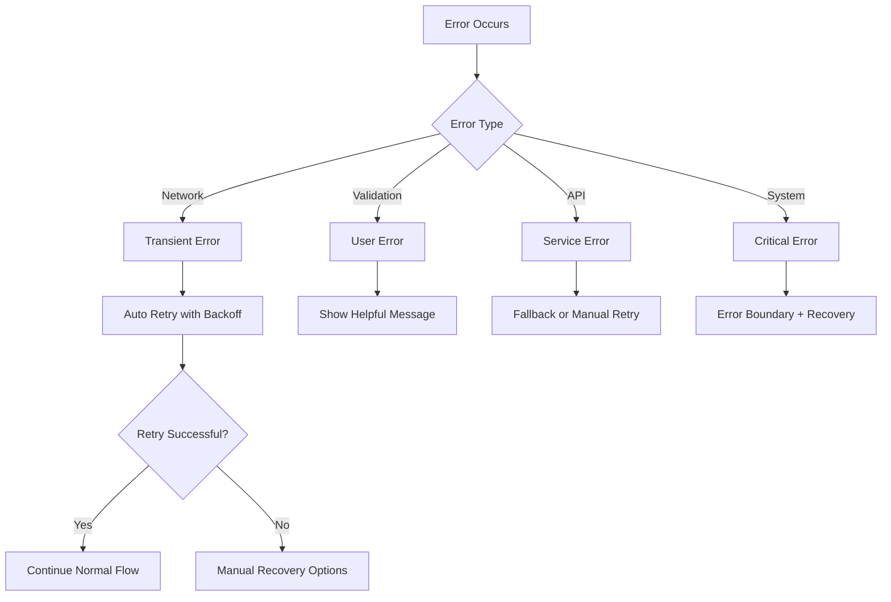

# AI Math Tutor - System Architecture
## Client-Server Interactions & AI Integration Points

**Version:** 3.0  
**Date:** January 2025  
**Last Updated:** Auth Implementation (Authentication, Database, Hybrid Storage)  
**Scope:** System design, data flows, AI integration architecture, authentication & persistence  
**Companion Docs:** cursor-prd-comprehensive.md, AI_Math_Tutor_Implementation_Tasks.md, Phase6-Enhancements-Planning.md, Auth-Implementation-Planning.md

---

## Table of Contents
1. [High-Level Architecture](#high-level-architecture)
2. [AI Integration Points](#ai-integration-points)
3. [Data Flow Patterns](#data-flow-patterns)
4. [Client-Server Communication](#client-server-communication)
5. [Image Processing Pipeline](#image-processing-pipeline)
6. [State Management Architecture](#state-management-architecture)
7. [Streaming Response Architecture](#streaming-response-architecture)
8. [AI Decision Logic](#ai-decision-logic)
9. [Phase 6 Enhancements](#phase-6-enhancements)
10. [Authentication & Database Architecture](#authentication--database-architecture)
11. [Security Architecture](#security-architecture)
12. [Performance & Scaling Considerations](#performance--scaling-considerations)
13. [Error Propagation & Recovery](#error-propagation--recovery)

---

## High-Level Architecture

### **System Overview**


### **Architecture Principles**

| Principle | Implementation | Rationale |
|-----------|----------------|-----------|
| **AI-First Design** | Claude AI at the core of all interactions | Socratic tutoring requires intelligent dialogue |
| **Edge-Optimized** | Vercel Edge functions for low latency | Fast response times critical for learning flow |
| **Stateless Server** | No server-side session storage | Simplifies deployment, scales horizontally |
| **Client-Side State** | React + localStorage for persistence | Reduces server complexity, supports anonymous users |
| **Streaming-Native** | Real-time AI response streaming | Natural conversation feel, reduces perceived latency |
| **Fail-Safe Design** | Multiple fallback layers | Graceful degradation for educational continuity |

---

## AI Integration Points

### **1. Primary AI Engine (Claude API)**
```
┌─────────────────────────────────────────────┐
│                Claude AI                    │
├─────────────────────────────────────────────┤
│ Model: claude-3-5-sonnet-20241022          │
│ Context Window: 200k tokens                │
│ Capabilities:                              │
│   • Socratic Dialogue Generation          │
│   • Vision API (Image → Text)             │
│   • Streaming Response                     │
│   • Mathematical Reasoning                 │
└─────────────────────────────────────────────┘
          ▲                    │
          │ Prompts            │ Responses
          │                    ▼
┌─────────────────────────────────────────────┐
│            AI Orchestration Layer          │
├─────────────────────────────────────────────┤
│ • System Prompt Management                 │
│ • Response Validation                      │
│ • Context Window Management                │
│ • Retry Logic                              │
│ • Cost Optimization                        │
└─────────────────────────────────────────────┘
```

### **2. AI Decision Points**

#### **Text Problem Processing**
```typescript
// AI Decision Flow
type AIDecisionPoint = {
  input: UserMessage;
  context: ConversationHistory;
  decision: 'socratic_response' | 'clarification_needed' | 'hint_required';
  confidence: number;
}

// Socratic Response Generation
if (studentStuck && turnCount > 2) {
  prompt = SOCRATIC_PROMPT + HINT_GUIDANCE;
} else if (studentProgressing) {
  prompt = SOCRATIC_PROMPT + ENCOURAGEMENT_FOCUS;
} else {
  prompt = SOCRATIC_PROMPT + STANDARD_GUIDANCE;
}
```

#### **Image Problem Extraction**
```typescript
// Vision API Decision Matrix
type ImageAnalysisResult = {
  problemCount: number;
  confidence: 'high' | 'medium' | 'low';
  content: 'problem' | 'solution' | 'unclear' | 'non_math';
  extraction: string[];
}

// Multi-step AI Processing
const visionResult = await claudeVision.analyze(image);
if (visionResult.confidence === 'low') {
  // Trigger user confirmation workflow
  return { type: 'UNCERTAIN', text: visionResult.extraction[0] };
} else if (visionResult.problemCount > 1) {
  // Trigger problem selection workflow  
  return { type: 'MULTIPLE_PROBLEMS', problems: visionResult.extraction };
}
```

### **3. AI Response Validation Pipeline**
```
User Input → Claude AI → Response Validation → Client
                ↓              ↓
        [Direct Answer     [Pass Through]
         Detection]             ↓
             ↓              Streaming to
        [Regenerate with     Client UI
         Stricter Prompt]
```

---

## Data Flow Patterns

### **1. Text Problem Solving Flow**



### **2. Image Problem Extraction Flow**



### **3. Real-Time Streaming Data Flow**

```
Client Request → Server → Claude AI
     ↑                        ↓
     └── Streaming ← Server ← Streaming Response
         Response              Chunks
         
Timeline:
T+0ms:    Request sent
T+200ms:  First token received  
T+300ms:  Token displayed to user
T+500ms:  Partial sentence visible
T+2000ms: Complete response displayed
```

---

## Client-Server Communication

### **API Contract Design**

#### **POST /api/chat**
```typescript
// Request Schema
interface ChatRequest {
  messages: Array<{
    role: 'user' | 'assistant';
    content: string;
    image?: string; // base64 encoded
    timestamp?: number;
  }>;
}

// Response Schema (Streaming)
interface ChatResponse {
  // Server-Sent Events stream
  data: string; // JSON chunks
  // Final format matches Vercel AI SDK
}

// Error Response Schema
interface ChatError {
  error: string;
  code: 'RATE_LIMIT' | 'INVALID_KEY' | 'NETWORK_ERROR' | 'VALIDATION_ERROR';
  retryAfter?: number; // seconds
  details?: string;
}
```

### **Communication Patterns**

#### **1. Standard Text Exchange**
```
Client                           Server
  │                               │
  ├─ POST /api/chat              ─┤
  │  {messages: [...]}            │
  │                               ├─ Validate request
  │                               ├─ Call Claude API  
  │                               ├─ Validate response
  ├─ SSE stream starts           ─┤
  ├─ data: {"chunk": "What"}     ─┤
  ├─ data: {"chunk": " do"}      ─┤
  ├─ data: {"chunk": " we know?"} ─┤ 
  ├─ data: {"done": true}        ─┤
  │                               │
```

#### **2. Image Processing Exchange**
```
Client                           Server
  │                               │
  ├─ POST /api/chat              ─┤
  │  {messages: [...], image: base64} │
  │                               ├─ Validate image
  │                               ├─ Process with Vision API
  │                               ├─ Parse extraction result
  ├─ JSON response               ─┤
  │  {type: "TWO_PROBLEMS",       │
  │   problems: [...]}            │
  │                               │
```

#### **3. Error Recovery Communication**
```
Client                           Server
  │                               │
  ├─ POST /api/chat              ─┤
  │                               ├─ Rate limit exceeded (429)
  ├─ HTTP 429 + retry info       ─┤
  │  {error: "...", retryAfter: 60}│
  │                               │
  ├─ Wait 60 seconds              │
  ├─ Retry POST /api/chat        ─┤
  │                               ├─ Success
  ├─ SSE stream starts           ─┤
```

---

## Image Processing Pipeline

### **Client-Side Processing**


### **Server-Side AI Processing**


### **Image Processing Data Transformations**

```typescript
// Client-side transformations
File → Validation → Compression → Base64 → Server

// Server-side transformations  
Base64 → Claude Vision → Problem Analysis → Classification → Response

// Data size optimization
Original Image (5MB) 
  → Compressed (800KB) 
  → Base64 (1.1MB) 
  → Vision API (processed)
  → Text Response (2KB)
```

---

## State Management Architecture

### **Client-Side State Layers**

```
┌─────────────────────────────────────┐
│           React Component State      │  ← UI state, form inputs
├─────────────────────────────────────┤
│           useChat Hook State        │  ← Messages, loading, errors  
├─────────────────────────────────────┤
│           Custom Hook State         │  ← Conversation state, image upload
├─────────────────────────────────────┤
│           localStorage              │  ← Persistence layer
└─────────────────────────────────────┘
```

### **State Flow Architecture**
```typescript
// State Management Pattern
interface AppState {
  // Managed by useChat (Vercel AI SDK)
  messages: Message[];
  isLoading: boolean;
  error: Error | null;
  
  // Custom application state
  conversationState: 'chatting' | 'selecting-problem' | 'confirming-extraction';
  pendingProblems: string[];
  currentImage?: string;
  
  // Persistence state
  hasUnsavedChanges: boolean;
  lastSaved: Date;
}

// State Transitions
const stateTransitions = {
  'chatting': ['selecting-problem', 'confirming-extraction'],
  'selecting-problem': ['chatting'],
  'confirming-extraction': ['chatting']
};
```

### **Data Persistence Strategy**

```mermaid
graph LR
    A[User Action] --> B[Update React State]
    B --> C{State Changed?}
    C -->|Yes| D[Update localStorage]
    C -->|No| E[No Action]
    D --> F{Quota Exceeded?}
    F -->|Yes| G[Cleanup Old Data]
    F -->|No| H[Save Successfully]
    
    subgraph "Persistence Layer (Phase 6)"
        I[conversation-history: ConversationSession[]]
        J[math-tutor-xp: XPState]
        K[math-tutor-tts-settings: TTSSettings]
        L[math-tutor-stt-settings: STTSettings]
        M[math-tutor-conversation: Message[]]
        N[attempts_*: Attempt counts]
    end
```

### **Phase 6 Storage Architecture**

The application now uses a structured localStorage approach with multiple storage keys:

```typescript
// Storage keys and their purposes
const STORAGE_KEYS = {
  // Phase 6: Enhanced conversation history
  CONVERSATION_HISTORY: 'math-tutor-conversation-history',
  // Phase 6: XP system for gamification
  XP_STATE: 'math-tutor-xp',
  // Phase 6: Voice interface settings
  TTS_SETTINGS: 'math-tutor-tts-settings',
  STT_SETTINGS: 'math-tutor-stt-settings',
  // Legacy: Current conversation (backward compatible)
  CURRENT_CONVERSATION: 'math-tutor-conversation',
  // Attempt tracking per problem
  ATTEMPTS: (signature: string) => `attempts_${signature}`,
};
```

**Storage Management:**
- **Quota Handling**: Automatic cleanup of oldest 25% of sessions when quota exceeded
- **Version Migration**: Support for data structure migrations via version field
- **Size Limits**: Max 50 sessions, 100 messages per session
- **Utility Layer**: `app/lib/local-storage.ts` provides type-safe get/set/remove operations

---

## Streaming Response Architecture

### **Real-Time Communication Stack**

```
┌─────────────────────────────────────┐
│        Browser (EventSource)        │  ← Client-side streaming
├─────────────────────────────────────┤  
│        Vercel Edge Runtime          │  ← Low-latency edge processing
├─────────────────────────────────────┤
│        Next.js Streaming API        │  ← Server-sent events
├─────────────────────────────────────┤
│        Vercel AI SDK               │  ← Stream management
├─────────────────────────────────────┤
│        Claude API (SSE)            │  ← AI response streaming
└─────────────────────────────────────┘
```

### **Streaming Performance Optimizations**

#### **Chunk Processing Strategy**
```typescript
// Optimized streaming processing
interface StreamChunk {
  text: string;
  timestamp: number;
  tokenCount: number;
}

// Client-side buffer management
class StreamBuffer {
  private buffer: string = '';
  private flushTimeout?: NodeJS.Timeout;
  
  append(chunk: string) {
    this.buffer += chunk;
    this.scheduleFlush();
  }
  
  private scheduleFlush() {
    // Debounce rapid chunks for smooth UI updates
    clearTimeout(this.flushTimeout);
    this.flushTimeout = setTimeout(() => {
      this.flush();
    }, 16); // 60fps update rate
  }
}
```

#### **Network Resilience**


---

## AI Decision Logic

### **Socratic Response Decision Tree**



### **AI Context Management**

```typescript
// Context Window Management
interface AIContext {
  problemText: string;
  conversationHistory: Message[];
  studentLevel: 'elementary' | 'middle' | 'high';
  stuckCount: number;
  lastHintGiven?: string;
  progressMarkers: string[];
}

// Context Optimization Strategy
class ContextManager {
  optimize(context: AIContext): OptimizedContext {
    // Keep only relevant conversation turns
    const relevantTurns = context.conversationHistory
      .slice(-10) // Last 10 messages
      .filter(msg => msg.role === 'user' || msg.content.includes('?'));
    
    return {
      ...context,
      conversationHistory: relevantTurns,
      tokenCount: this.estimateTokens(relevantTurns)
    };
  }
}
```

### **AI Response Quality Assurance**

```typescript
// Multi-layer validation pipeline
interface ResponseValidation {
  containsDirectAnswer: boolean;
  hasSocraticQuestions: boolean;
  usesEncouragingLanguage: boolean;
  isOnTopic: boolean;
  confidence: number;
}

const validateResponse = async (
  response: string, 
  context: AIContext
): Promise<ResponseValidation> => {
  return {
    containsDirectAnswer: DIRECT_ANSWER_PATTERNS.some(p => p.test(response)),
    hasSocraticQuestions: /\?/.test(response),
    usesEncouragingLanguage: ENCOURAGING_PATTERNS.some(p => p.test(response)),
    isOnTopic: calculateTopicRelevance(response, context.problemText),
    confidence: calculateOverallConfidence(response)
  };
};
```

---

## Phase 6 Enhancements

### **Overview**

Phase 6 introduced five major enhancements to improve user engagement, persistence, and accessibility:

1. **Enhanced Conversation History** - Searchable, filterable session management
2. **XP System** - Gamification with points, levels, and progress tracking
3. **AI Problem Generation** - Dynamic problem creation with variety and difficulty matching
4. **Voice Interface** - Text-to-Speech (TTS) and Speech-to-Text (STT) support
5. **Polished Intro Screen** - Engaging welcome experience with animations

---

### **1. Enhanced Conversation History**

**Architecture:**
```
┌─────────────────────────────────────┐
│    ConversationHistory Component    │
├─────────────────────────────────────┤
│ • Search by title/problem text     │
│ • Filter by problem type           │
│ • Export/Delete sessions           │
│ • Auto-save on message updates     │
└─────────────────────────────────────┘
              ↓
┌─────────────────────────────────────┐
│  conversation-history.ts (Storage)   │
├─────────────────────────────────────┤
│ • saveConversationSession()         │
│ • loadConversationHistory()         │
│ • deleteConversationSession()       │
│ • exportConversationSession()       │
│ • Quota management                  │
└─────────────────────────────────────┘
              ↓
┌─────────────────────────────────────┐
│      localStorage (Browser)         │
│  math-tutor-conversation-history    │
└─────────────────────────────────────┘
```

**Data Structure:**
```typescript
interface ConversationSession {
  id: string;                    // UUID or timestamp-based
  title: string;                 // Auto-generated from first problem
  problemText: string;           // Initial problem
  messages: ConversationMessage[]; // Full conversation
  createdAt: number;             // Timestamp
  updatedAt: number;             // Timestamp
  completed: boolean;            // Whether problem was solved
  xpEarned: number;              // XP from this session
  problemType?: string;          // Algebra, Geometry, etc.
  difficulty?: 'beginner' | 'intermediate' | 'advanced';
}

interface ConversationHistoryStorage {
  sessions: ConversationSession[];
  currentSessionId: string | null;
  lastUpdated: number;
  version: number;               // For migration support
}
```

**Features:**
- Auto-save sessions on message updates (debounced 1s)
- Search and filter UI for finding past conversations
- Export sessions as text files
- Quota management (removes oldest 25% when exceeded)
- Version migration support for future schema changes

---

### **2. XP System (Gamification)**

**Architecture:**
```
┌─────────────────────────────────────┐
│      XPDisplay Component            │
│  (Shows level, XP, progress bar)    │
└─────────────────────────────────────┘
              ↓
┌─────────────────────────────────────┐
│      XPAnimation Component          │
│  (Animated notifications)           │
└─────────────────────────────────────┘
              ↓
┌─────────────────────────────────────┐
│      xp-system.ts (Logic)            │
├─────────────────────────────────────┤
│ • calculateAttemptXP()              │
│ • calculateSolveXP()                 │
│ • calculateLevel()                   │
│ • addXP()                            │
│ • getTotalXP()                       │
└─────────────────────────────────────┘
              ↓
┌─────────────────────────────────────┐
│      localStorage                   │
│  math-tutor-xp                      │
└─────────────────────────────────────┘
```

**XP Rewards:**
- **Attempt XP**: Base 1 XP, +2 bonus if work shown
- **Solve XP**: 
  - Beginner: 10 base (+5 first-try, +3 persistence)
  - Intermediate: 15 base (+5 first-try, +3 persistence)
  - Advanced: 20 base (+5 first-try, +3 persistence)
- **Level Calculation**: 100 XP per level (Level 1 = 0-99 XP, Level 2 = 100-199 XP, etc.)

**Integration Points:**
- Awards attempt XP on each user message
- Awards solve XP when problem completion detected
- Shows animated notifications for XP gains
- Updates level and progress bar in real-time

---

### **3. AI Problem Generation**

**Architecture:**
```
┌─────────────────────────────────────┐
│   ProblemGenerator Component        │
│  (Type/difficulty selection UI)    │
└─────────────────────────────────────┘
              ↓
┌─────────────────────────────────────┐
│  /api/chat/generate-problem         │
│  (Next.js API Route)               │
└─────────────────────────────────────┘
              ↓
┌─────────────────────────────────────┐
│      Claude AI API                  │
│  (claude-sonnet-4-20250514)        │
│  • Generates unique problems        │
│  • Returns JSON: {problem, type,    │
│    difficulty}                      │
└─────────────────────────────────────┘
```

**Features:**
- Generates problems across types: Algebra, Geometry, Calculus, Fractions, Word Problems
- Supports difficulty levels: beginner, intermediate, advanced
- Excludes previously generated problems (via `excludeProblems` parameter)
- Returns structured JSON with problem text, type, and difficulty
- Integrated into "Try Another Problem" flow after solving

**Prompt Engineering:**
- Temperature: 0.8 (for variety)
- Strict JSON response format required
- LaTeX formatting for math expressions
- Single, self-contained problems only

---

### **4. Voice Interface**

**Architecture:**
```
┌─────────────────────────────────────┐
│      VoiceControls Component        │
│  (TTS/STT toggle buttons)          │
└─────────────────────────────────────┘
              ↓
┌─────────────────────────────────────┐
│      tts.ts (Text-to-Speech)        │
│  • SpeechSynthesis API              │
│  • Voice selection                   │
│  • Rate/pitch/volume control         │
└─────────────────────────────────────┘
              ↓
┌─────────────────────────────────────┐
│      stt.ts (Speech-to-Text)        │
│  • SpeechRecognition API             │
│  • Continuous/interim results        │
│  • Language selection                │
└─────────────────────────────────────┘
```

**Text-to-Speech (TTS):**
- Uses browser `SpeechSynthesis` API
- Auto-speaks assistant messages when enabled
- Settings persisted in localStorage
- Voice selection from available browser voices
- Rate, pitch, volume controls

**Speech-to-Text (STT):**
- Uses browser `SpeechRecognition` API (Chrome/Edge)
- Continuous or one-shot recognition modes
- Interim results for real-time feedback
- Error handling for unsupported browsers
- Settings persisted in localStorage

**Browser Compatibility:**
- **Chrome/Edge**: Full TTS + STT support
- **Safari**: TTS supported, limited STT
- **Firefox**: Limited voice support
- **Mobile**: iOS Safari (TTS), Android Chrome (full support)

---

### **5. Polished Intro Screen**

**Architecture:**
```
┌─────────────────────────────────────┐
│      IntroScreen Component          │
│  (Animated welcome screen)          │
└─────────────────────────────────────┘
              ↓
┌─────────────────────────────────────┐
│      intro-screen.ts (Logic)        │
│  • shouldShowIntro()                │
│  • markIntroAsShown()               │
│  • resetIntro()                      │
└─────────────────────────────────────┘
```

**Show/Hide Logic:**
- Shows for new users (no localStorage entry)
- Shows if version changed (migration)
- Shows if >30 days since last shown
- Hides if user has 3+ sessions or 50+ XP (returning user)
- Can be skipped by returning users

**Features:**
- Animated entrance/exit transitions
- Feature cards with staggered animations
- User stats display (XP, problems solved) for returning users
- Floating math symbols background animation
- Gradient backgrounds and modern styling

---

### **Phase 6 Component Hierarchy**

```
Home (page.tsx)
├── IntroScreen (conditional)
└── ChatInterface
    ├── ConversationHistory (modal)
    ├── XPDisplay (header)
    ├── XPAnimation (overlay, multiple)
    ├── VoiceControls (message input area)
    ├── ProblemGenerator (modal)
    ├── TryAnotherProblemPrompt (overlay)
    ├── MessageList
    └── MessageInput
        └── VoiceControls (STT input)
```

---

### **Phase 6 API Routes**

```
/api/chat/generate-problem (POST)
  Request: { type, difficulty, excludeProblems? }
  Response: { problem, type, difficulty }
  Uses: Claude AI (claude-sonnet-4-20250514)
```

---

## Authentication & Database Architecture

### **Overview**

The application now supports user authentication with Google OAuth and hybrid data storage (localStorage + PostgreSQL database). This enables cross-device sync for authenticated users while anonymous users can still use the app with localStorage-only persistence (data persists across page refreshes, but the app requires network connectivity for AI interactions).

### **Authentication Stack**

- **NextAuth.js v5**: Authentication framework with Google OAuth provider
- **Prisma**: ORM for database operations
- **PostgreSQL**: Database for user data, conversations, and XP state
- **Hybrid Storage**: localStorage (always) + database (when authenticated)

### **Data Storage Strategy**



**Storage Rules:**
1. **Always save to localStorage** - Persists data across page refreshes, supports anonymous users
2. **If authenticated, also save to database** - Enables cross-device sync
3. **On login, sync localStorage → database** - Migrates existing data
4. **On database failure, fallback to localStorage** - Graceful degradation

### **Database Schema**

```prisma
model User {
  id            String
  email         String? @unique
  name          String?
  image         String?
  conversations Conversation[]
  xpState       XPState?
  accounts      Account[]
  sessions      Session[]
}

model Conversation {
  id          String
  userId      String
  title       String
  problemText String
  messages    Json
  completed   Boolean
  xpEarned    Int
  createdAt   DateTime
  updatedAt   DateTime
}

model XPState {
  id           String   @unique
  userId       String   @unique
  totalXP      Int
  level        Int
  transactions Json
  updatedAt    DateTime
}
```

### **API Routes**

- `/api/auth/[...nextauth]` - NextAuth authentication handlers
- `/api/conversations` - CRUD operations for conversation sessions
- `/api/xp` - Get/update XP state
- `/api/sync` - Sync localStorage data to database on login

### **Hybrid Storage Implementation**

**Conversation History:**
- `saveConversationSessionHybrid()` - Saves to both localStorage and database
- `loadConversationHistoryHybrid()` - Loads from database (if authenticated) or localStorage
- `syncLocalStorageToServer()` - Syncs all localStorage data on login

**XP System:**
- `saveXPStateHybrid()` - Saves to both localStorage and database
- `loadXPStateHybrid()` - Loads from database (if authenticated) or localStorage

### **User Flow**

1. **Anonymous User:**
   - Uses app without signing in
   - All data stored in localStorage
   - Data persists across page refreshes
   - No cross-device sync
   - Requires network for AI interactions

2. **Sign In:**
   - Click "Sign In" → Google OAuth flow
   - On success, localStorage data syncs to database
   - Future actions save to both localStorage and database

3. **Authenticated User:**
   - Data persists in database
   - Accessible from any device
   - localStorage still used for session persistence

4. **Sign Out:**
   - Returns to anonymous mode
   - localStorage continues to work
   - Database data remains (for future login)

---

## Security Architecture

### **API Security Layers**

```
┌─────────────────────────────────────┐
│           Rate Limiting             │  ← DOS protection
├─────────────────────────────────────┤
│           Input Validation          │  ← Injection prevention  
├─────────────────────────────────────┤
│           Authentication            │  ← API key validation
├─────────────────────────────────────┤
│           Data Sanitization         │  ← XSS prevention
├─────────────────────────────────────┤
│           Response Filtering        │  ← Content safety
└─────────────────────────────────────┘
```

### **Client-Side Security**

#### **Input Sanitization**
```typescript
// Image upload security
const validateImageSecurely = (file: File): SecurityCheck => {
  return {
    fileTypeValid: ALLOWED_MIME_TYPES.includes(file.type),
    fileSizeValid: file.size <= MAX_FILE_SIZE,
    fileNameSafe: !/[<>:"/\\|?*]/.test(file.name),
    noEmbeddedScripts: true // Browser handles this for images
  };
};

// Text input sanitization  
const sanitizeUserInput = (input: string): string => {
  return DOMPurify.sanitize(input, {
    ALLOWED_TAGS: [], // No HTML allowed
    ALLOWED_ATTR: []
  });
};
```

#### **Data Privacy**
```typescript
// Privacy-first data handling
interface PrivacyControls {
  // No server-side storage of conversations
  dataStorage: 'localStorage-only';
  
  // No user tracking
  analytics: 'none';
  
  // API key protection
  keyExposure: 'server-side-only';
  
  // Image handling
  imageRetention: 'processing-only'; // Not stored
}
```

### **Server-Side Security**

#### **API Route Protection**
```typescript
// Request validation middleware
const validateRequest = (req: Request): ValidationResult => {
  // Rate limiting
  if (exceedsRateLimit(req.ip)) {
    throw new RateLimitError('Too many requests');
  }
  
  // Input size limits
  if (req.body.length > MAX_REQUEST_SIZE) {
    throw new PayloadTooLargeError('Request too large');
  }
  
  // Content validation
  const { messages } = req.body;
  if (!Array.isArray(messages)) {
    throw new ValidationError('Invalid messages format');
  }
  
  return { valid: true };
};
```

---

## Performance & Scaling Considerations

### **Performance Optimization Stack**

```
┌─────────────────────────────────────┐
│           CDN Caching               │  ← Static asset caching
├─────────────────────────────────────┤
│           Edge Functions            │  ← Geographic distribution
├─────────────────────────────────────┤  
│           Response Streaming        │  ← Perceived performance
├─────────────────────────────────────┤
│           Bundle Optimization       │  ← Code splitting
├─────────────────────────────────────┤
│           Image Optimization        │  ← Compression & sizing
└─────────────────────────────────────┘
```

### **Scaling Architecture**

#### **Horizontal Scaling Model**


#### **Performance Metrics & Monitoring**

```typescript
// Performance tracking
interface PerformanceMetrics {
  // Client-side metrics
  timeToFirstByte: number;
  firstContentfulPaint: number;
  streamingStartTime: number;
  streamingEndTime: number;
  
  // Server-side metrics  
  apiResponseTime: number;
  claudeApiLatency: number;
  imageProcessingTime: number;
  
  // User experience metrics
  conversationTurns: number;
  problemSolveTime: number;
  errorRate: number;
}

// Performance optimization triggers
const optimizationTriggers = {
  // If response time > 3s, implement caching
  slowResponse: 3000,
  
  // If streaming delay > 500ms, optimize chunks  
  streamingDelay: 500,
  
  // If bundle size > 2MB, implement code splitting
  bundleSize: 2 * 1024 * 1024
};
```

### **Cost Optimization Architecture**

#### **AI API Cost Management**
```typescript
// Cost-aware request handling
interface CostControls {
  // Request optimization
  tokenLimits: {
    maxInputTokens: 4000;
    maxOutputTokens: 1000;
  };
  
  // Caching strategy  
  responseCache: {
    commonProblems: Map<string, CachedResponse>;
    cacheTTL: 3600; // 1 hour
  };
  
  // Usage monitoring
  dailyLimits: {
    textRequests: 1000;
    visionRequests: 200;
    estimatedCost: 50; // USD
  };
}
```

---

## Error Propagation & Recovery

### **Error Classification System**



### **Recovery Strategy Architecture**

#### **Graceful Degradation Layers**
```typescript
// Multi-tier fallback system
interface FallbackStrategy {
  // Tier 1: Full functionality
  primary: {
    textInput: true;
    imageUpload: true;
    streamingResponses: true;
    latexRendering: true;
  };
  
  // Tier 2: Core functionality  
  degraded: {
    textInput: true;
    imageUpload: false; // Fallback to manual entry
    streamingResponses: false; // Full response only
    latexRendering: true;
  };
  
  // Tier 3: Essential functionality
  minimal: {
    textInput: true;
    imageUpload: false;
    streamingResponses: false; 
    latexRendering: false; // Raw text only
  };
}
```

#### **Error Recovery Workflows**

```typescript
// Comprehensive error recovery
class ErrorRecoveryManager {
  async handleError(error: AppError, context: ErrorContext): Promise<RecoveryAction> {
    switch (error.category) {
      case 'RATE_LIMIT':
        return this.handleRateLimit(error);
        
      case 'IMAGE_PROCESSING':
        return this.handleImageError(error, context);
        
      case 'AI_RESPONSE':
        return this.handleAIError(error, context);
        
      case 'NETWORK':
        return this.handleNetworkError(error);
        
      default:
        return this.handleGenericError(error);
    }
  }
  
  private async handleRateLimit(error: RateLimitError): Promise<RecoveryAction> {
    return {
      type: 'RETRY_WITH_DELAY',
      delay: error.retryAfter * 1000,
      maxRetries: 3,
      userMessage: `I'm getting lots of questions right now. Retrying in ${error.retryAfter} seconds...`
    };
  }
}
```

---

## Conclusion

This architecture supports:

✅ **AI-Centric Design** - Claude AI as the intelligent core with validation layers  
✅ **Real-Time Interaction** - Streaming responses with network resilience  
✅ **Scalable Foundation** - Stateless, edge-optimized, horizontally scalable  
✅ **Robust Error Handling** - Multi-tier fallbacks and graceful degradation  
✅ **Security-First** - Input validation, rate limiting, privacy protection  
✅ **Performance Optimized** - Streaming, caching, and bundle optimization  

The architecture ensures that AI interactions feel natural and immediate while maintaining reliability, security, and cost efficiency at scale.

---

**Architecture complements:**
- **cursor-prd-comprehensive.md** - Technical implementation details
- **AI_Math_Tutor_Implementation_Tasks.md** - Development execution plan
